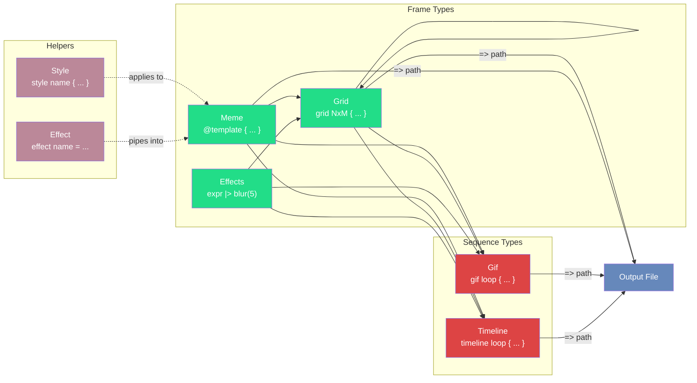

# Mac Type System

Mac's visual types form a two-category system: **frame types** produce pixels and compose freely, **sequence types** produce frame sequences and are output-level containers only.

## Type Hierarchy

```mermaid
graph TD
    subgraph "Mac Type System"
        direction TB

        subgraph "Frame Types (produce pixels)"
            ML["@template { top: '...' bottom: '...' }<br/><i>Meme Literal</i>"]
            GB["grid NxM { entries }<br/><i>Grid Block</i>"]
            EFX["expr |> effect<br/><i>Effect Pipeline</i>"]
        end

        subgraph "Sequence Types (produce frame sequences)"
            GIF["gif loop { frames }<br/><i>GIF Block</i>"]
            TL["timeline loop { keyframes }<br/><i>Timeline Block</i>"]
        end

        subgraph "Declaration Types"
            STY["style name { props }<br/><i>Style Block</i>"]
            EFF["effect name = expr<br/><i>Effect Alias</i>"]
        end

        SAVE["expr => 'path'<br/><i>Save Expression</i>"]
    end

    subgraph "Prelude Classes (Mac language)"
        MEME_C["Meme<br/><small>template, topText, bottomText<br/>width, height, renderedPath<br/>.text() .resize() .save()</small>"]
        GIF_C["Gif<br/><small>_frames, frameCount<br/>.frame() .save()<br/>operator+(Frame)</small>"]
        TL_C["Timeline<br/><small>_tl (MacTimeline)<br/>.frame() .transition()<br/>.loop() .render() .save()</small>"]
        FRAME_C["Frame<br/><small>meme, duration</small>"]
        TMPL_C["Template<br/><small>name, path</small>"]
        SIZE_C["Size<br/><small>width, height</small>"]
        DUR_C["Duration<br/><small>ms</small>"]
        POS_C["Position<br/><small>Top, Bottom, Center</small>"]
        FMT_C["Format<br/><small>PNG, JPG, GIF</small>"]
    end

    subgraph "C++ Runtime Types (MacValue variant)"
        MAC_MEME["MacMeme<br/><small>templateName, imagePath<br/>topText, bottomText<br/>width, height, style</small>"]
        MAC_GIF["MacGif<br/><small>vector&lt;Frame&gt;<br/>frame = MacMeme + duration</small>"]
        MAC_TL["MacTimeline<br/><small>keyframes (pixels)<br/>transitions, holds<br/>easing, loopCount</small>"]
        MAC_MAP["MacMap<br/><small>_rendered: path<br/>_width, _height</small>"]
        MAC_INST["MacInstance<br/><small>className + fields</small>"]
        STYLE_MAP["MacMap<br/><small>color, outline, shadow<br/>background, fontSize</small>"]
        MAC_CALL["MacCallable<br/><small>composed functions</small>"]
    end

    %% Literal to Runtime mappings
    ML -->|"evaluates to"| MAC_INST
    MAC_INST -->|"className='Meme'"| MEME_C

    GIF -->|"evaluates to"| MAC_GIF
    TL -->|"evaluates to"| MAC_INST
    MAC_INST -->|"className='Timeline'<br/>wraps"| MAC_TL

    GB -->|"evaluates to"| MAC_MAP
    EFX -->|"evaluates to"| MAC_MAP

    STY -->|"stores"| STYLE_MAP
    EFF -->|"stores"| MAC_CALL

    %% Prelude wrapping
    GIF_C -.->|"wraps"| MAC_GIF
    TL_C -.->|"wraps"| MAC_TL
    MEME_C -.->|"uses"| MAC_MEME

    %% Composition rules
    ML -->|"goes inside"| GIF
    ML -->|"goes inside"| TL
    ML -->|"goes inside"| GB
    GB -->|"goes inside"| GIF
    GB -->|"goes inside"| TL
    GB -->|"goes inside"| GB
    EFX -->|"goes inside"| GIF
    EFX -->|"goes inside"| TL
    EFX -->|"goes inside"| GB

    GIF -.->|"cannot nest in"| GB
    TL -.->|"cannot nest in"| GB
    GIF -.->|"cannot nest in"| GIF
    TL -.->|"cannot nest in"| GIF

    %% Save
    GIF --> SAVE
    TL --> SAVE
    GB --> SAVE
    ML --> SAVE
    EFX --> SAVE

    %% Helper relationships
    FRAME_C -.->|"Meme + Duration"| MEME_C
    FRAME_C -.->|"Meme + Duration"| DUR_C
    MEME_C -.->|"uses"| TMPL_C
    MEME_C -.->|"uses"| SIZE_C
    MEME_C -.->|"uses"| POS_C

    %% Pixel flow
    MAC_MEME -->|"render()"| PIXELS["RGBA Pixels"]
    MAC_MAP -->|"getMemePixels()"| PIXELS
    MAC_INST -->|"getMemePixels()"| PIXELS
    PIXELS -->|"addFrame()"| MAC_GIF
    PIXELS -->|"addKeyframe()"| MAC_TL

    style ML fill:#4a9,color:#fff
    style GB fill:#4a9,color:#fff
    style EFX fill:#4a9,color:#fff
    style GIF fill:#c44,color:#fff
    style TL fill:#c44,color:#fff
    style STY fill:#b89,color:#fff
    style EFF fill:#b89,color:#fff
    style SAVE fill:#68b,color:#fff
    style PIXELS fill:#fa0,color:#fff
```



## Composition Rules



**Rule**: Frames compose into frames or sequences. Sequences never nest inside anything.

## Type Mapping

### Syntax to Runtime

| Syntax (v2 literal) | Prelude Class | C++ Runtime Type | Category |
|---|---|---|---|
| `@template { ... }` | `Meme` | `MacInstance` -> `MacMeme` | Frame |
| `grid NxM { ... }` | -- | `MacMap` (with `_rendered`) | Frame |
| `expr \|> effect` | -- | `MacMap` (with `_rendered`) | Frame |
| `gif loop { ... }` | `Gif` | `MacGif` | Sequence |
| `timeline loop { ... }` | `Timeline` | `MacInstance` -> `MacTimeline` | Sequence |
| `style name { ... }` | -- | `MacMap` (properties) | Declaration |
| `effect name = ...` | -- | `MacCallable` (composed) | Declaration |

### Prelude Classes

| Class | Purpose | Fields | Key Methods |
|---|---|---|---|
| `Meme` | Single image with text | `template`, `topText`, `bottomText`, `width`, `height` | `.text()`, `.resize()`, `.save()` |
| `Gif` | Frame sequence | `_frames`, `frameCount` | `.frame()`, `.save()` |
| `Timeline` | Keyframes with transitions | `_tl` (wraps `MacTimeline`) | `.frame()`, `.transition()`, `.loop()`, `.save()` |
| `Frame` | Meme + duration pair | `meme`, `duration` | -- |
| `Template` | Image source | `name`, `path` | -- |
| `Size` | Dimensions | `width`, `height` | `+`, `*`, `==` |
| `Duration` | Timing | `ms` | `+`, `*`, `==` |
| `Position` | Text placement | `name` | Constants: `Top`, `Bottom`, `Center` |
| `Format` | Output format | `name` | Constants: `PNG`, `JPG`, `GIF` |

### C++ Variant (MacValue)

```
MacValue = variant<
    string, double, bool, monostate,
    MacCallable,    // functions, composed effects
    MacInstance,     // prelude class instances
    MacArray,        // arrays
    MacMap,          // maps + rendered images
    MacMeme,         // raw meme (pixels + text)
    MacGif,          // raw GIF (frame sequence)
    MacTimeline      // raw timeline (keyframes + transitions)
>
```

### Pixel Flow

```
Meme instance (MacInstance)
    -> getMemePixels()
    -> MacMeme.render()
    -> RGBA pixel buffer
    -> effects (blur, sepia, etc.)
    -> saveTempImage()
    -> MacMap { _rendered: "/tmp/path.png" }

Frame types -> getMemePixels() -> RGBA pixels
Sequence types -> addFrame()/addKeyframe() -> GIF output
```

## Asymmetry Note

`gif { }` returns a raw `MacGif` variant, but `timeline { }` wraps its `MacTimeline` inside a prelude `Timeline` instance. This is why:

```mac
var g = gif loop { ... };
print type(g);       // "gif"

var tl = timeline loop { ... };
print type(tl);      // "instance"
```

## Style Properties

| Property | Type | Default | Description |
|---|---|---|---|
| `color` | `"#RRGGBB"` | `"#FFFFFF"` | Text color |
| `outline` | number | `3` | Outline width in pixels |
| `outlineColor` | `"#RRGGBB"` | `"#000000"` | Outline color |
| `shadow` | number | `0` | Shadow offset |
| `shadowColor` | `"#RRGGBBAA"` | `"#00000080"` | Shadow color with alpha |
| `fontSize` | number or `"sm"/"md"/"lg"/"xlg"` | auto | Font size override |
| `background` | `"#RRGGBB"` or `"#RRGGBBAA"` | none | Canvas background color |
